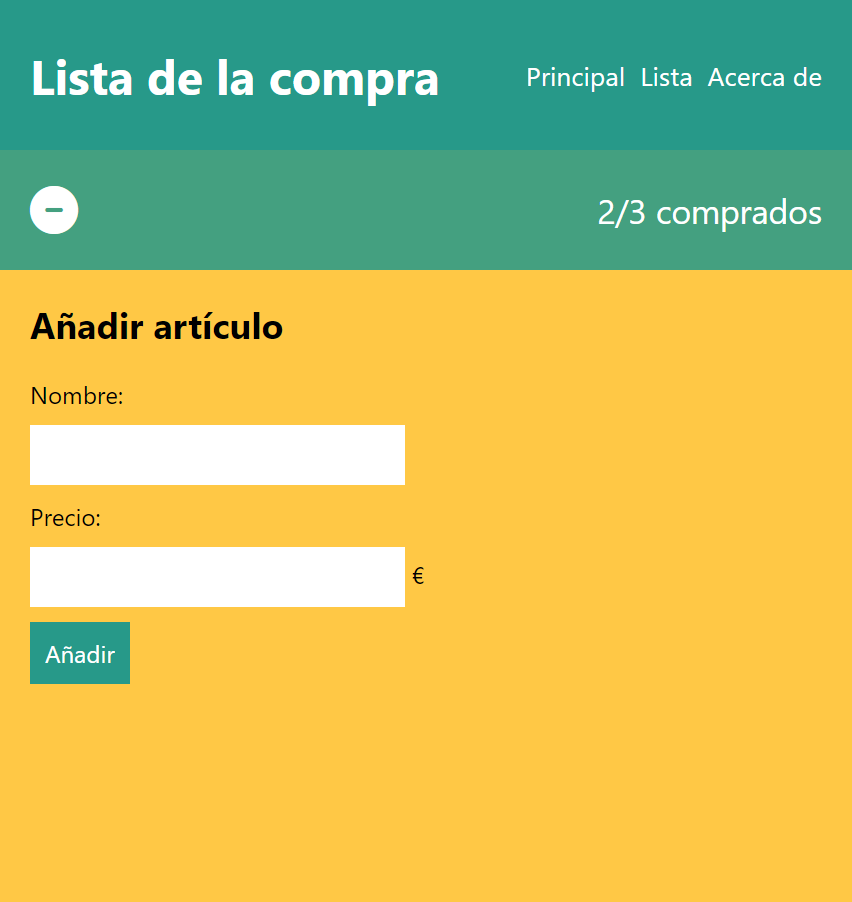
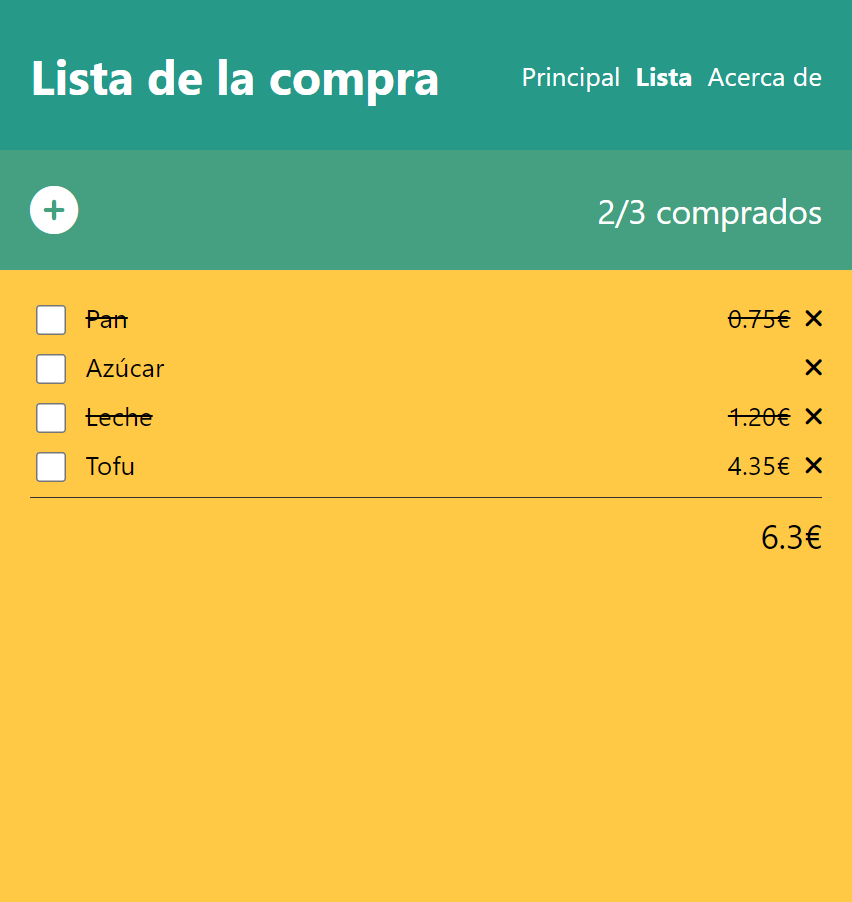

# Week 1 - Challenge 3

## Maquetación Lista de la compra

- Tendrás que maquetar el HTML y CSS de una aplicación web para gestionar la lista de la compra.
- Hay que maquetar la página para añadir un artículo (la del formulario). Si se acaba, se maquetará la página con la lista de artículos.
- La aplicación sólo se va a ver en móviles, no nos interesa cómo queda en dimensiones grandes.
- Para la tipografía usa un system font stack.
- La tipografía de iconos es la Font Awesome.

### Capturas:

Formulario:

Lista:

